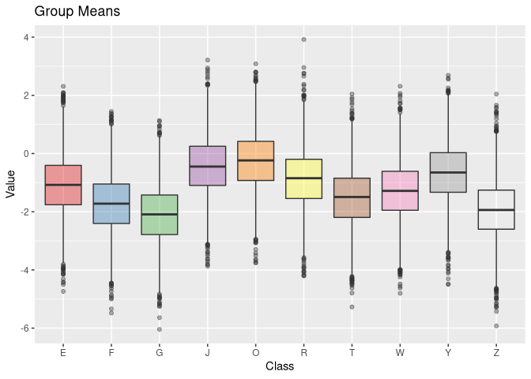

<!-- README.md is generated from README.Rmd. Please edit that file -->

# Binary vs. Ridge vs. Individual Linear Base-Learner

## Load compboost

``` r
Rcpp::compileAttributes("~/repos/compboost")
devtools::load_all( "~/repos/compboost")
#> Loading compboost
```

## Simulate data

``` r
# Simulate Data:
nclasses = 10L
nsim = 50000L

classes = sample(x = LETTERS, size = nclasses)
gmean = sample(nclasses) * rnorm(1)

idx = sample(x = seq_len(nclasses), size = nsim, replace = TRUE)

x = classes[idx]
y = gmean[idx] + rnorm(nsim)

df_cat = data.frame(x = x, y = y)

library(ggplot2)
ggplot(data = df_cat, aes(x = x, y = y, fill = x)) +
  geom_boxplot(alpha = 0.4, show.legend = FALSE) +
  scale_fill_brewer(palette = "Set1") +
  xlab("Class") +
  ylab("Value") +
  ggtitle("Group Means")
#> Warning in RColorBrewer::brewer.pal(n, pal): n too large, allowed maximum for palette Set1 is 9
#> Returning the palette you asked for with that many colors
```

<!-- -->

## Set parameter for compboost

``` r
learning_rate = 0.05
iter_max      = 2000L
```

## Fit linear model for each category in feature (current state of the art)

``` r
cboost_lin = Compboost$new(data = df_cat, target = "y", loss = LossQuadratic$new())
cboost_lin$addBaselearner(feature = "x", id = "category", bl_factory = BaselearnerPolynomial, intercept = FALSE)
cboost_lin$train(iter_max, trace = as.integer(iter_max / 4))
#>    1/2000   risk = 0.67  
#>  500/2000   risk = 0.5  
#> 1000/2000   risk = 0.5  
#> 1500/2000   risk = 0.5  
#> 2000/2000   risk = 0.5  
#> 
#> 
#> Train 2000 iterations in 6 Seconds.
#> Final risk based on the train set: 0.5
```

## Fit ridge regression on categorical feature

``` r
response = ResponseRegr$new("mpg", as.matrix(df_cat$y))

cdata_source = CategoricalData$new(df_cat$x, "x")
bl = BaselearnerCategoricalRidge$new(cdata_source, list(df = 3))

factory_list = BlearnerFactoryList$new()
factory_list$registerFactory(bl)

loss_quadratic = LossQuadratic$new()
optimizer = OptimizerCoordinateDescent$new()

log_iterations = LoggerIteration$new(" iterations", TRUE, iter_max)
logger_list = LoggerList$new()
logger_list$registerLogger(log_iterations)

cboost_ridge = Compboost_internal$new(
  response      = response,
  learning_rate = learning_rate,
  stop_if_all_stopper_fulfilled = FALSE,
  factory_list = factory_list,
  loss         = loss_quadratic,
  logger_list  = logger_list,
  optimizer    = optimizer
)
cboost_ridge$train(trace = as.integer(iter_max / 4))
#>    1/2000   risk = 0.66  
#>  500/2000   risk = 0.5  
#> 1000/2000   risk = 0.5  
#> 1500/2000   risk = 0.5  
#> 2000/2000   risk = 0.5  
#> 
#> 
#> Train 2000 iterations in 3 Seconds.
#> Final risk based on the train set: 0.5
```

## Fit ridge regression on categorical feature with binary base-learner

``` r
response = ResponseRegr$new("y", as.matrix(df_cat$y))

cdata_source = CategoricalData$new(df_cat$x, "x")

bl_list = lapply(classes, function (cl) BaselearnerCategoricalBinary$new(cdata_source, cl))

factory_list = BlearnerFactoryList$new()
temp = lapply(bl_list, function (bl) factory_list$registerFactory(bl))

loss_quadratic = LossQuadratic$new()
optimizer = OptimizerCoordinateDescent$new()

log_iterations = LoggerIteration$new(" iterations", TRUE, iter_max)
logger_list = LoggerList$new()
logger_list$registerLogger(log_iterations)

cboost_binary = Compboost_internal$new(
  response      = response,
  learning_rate = learning_rate,
  stop_if_all_stopper_fulfilled = FALSE,
  factory_list = factory_list,
  loss         = loss_quadratic,
  logger_list  = logger_list,
  optimizer    = optimizer
)
cboost_binary$train(trace = as.integer(iter_max / 4))
#>    1/2000   risk = 0.67  
#>  500/2000   risk = 0.5  
#> 1000/2000   risk = 0.5  
#> 1500/2000   risk = 0.5  
#> 2000/2000   risk = 0.5  
#> 
#> 
#> Train 2000 iterations in 3 Seconds.
#> Final risk based on the train set: 0.5
```

## Compare Estimates

|         | Real.Means | Estimate.Ridge | Estimate.Binary | Estimate.Linear..Binary. |
| ------- | ---------: | -------------: | --------------: | -----------------------: |
| x\_x\_G |   \-2.1506 |       \-2.1135 |        \-2.1135 |                 \-2.1135 |
| x\_x\_Z |   \-1.9355 |       \-1.9305 |        \-1.9305 |                 \-1.9305 |
| x\_x\_F |   \-1.7204 |       \-1.7273 |        \-1.7272 |                 \-1.7272 |
| x\_x\_T |   \-1.5054 |       \-1.5113 |        \-1.5112 |                 \-1.5112 |
| x\_x\_W |   \-1.2903 |       \-1.2822 |        \-1.2822 |                 \-1.2822 |
| x\_x\_E |   \-1.0753 |       \-1.0832 |        \-1.0833 |                 \-1.0833 |
| x\_x\_R |   \-0.8602 |       \-0.8578 |        \-0.8579 |                 \-0.8579 |
| x\_x\_Y |   \-0.6452 |       \-0.6503 |        \-0.6503 |                 \-0.6503 |
| x\_x\_J |   \-0.4301 |       \-0.4328 |        \-0.4328 |                 \-0.4328 |
| x\_x\_O |   \-0.2151 |       \-0.2494 |        \-0.2494 |                 \-0.2494 |

## Microbenchmark

| expr   |    min |     lq |   mean | median |     uq |    max | neval |
| :----- | -----: | -----: | -----: | -----: | -----: | -----: | ----: |
| linear | 10.110 | 10.580 | 10.695 | 10.618 | 10.735 | 12.102 |    20 |
| ridge  |  3.668 |  3.860 |  3.869 |  3.888 |  3.919 |  4.026 |    20 |
| binary |  4.971 |  5.253 |  5.251 |  5.280 |  5.299 |  5.559 |    20 |
