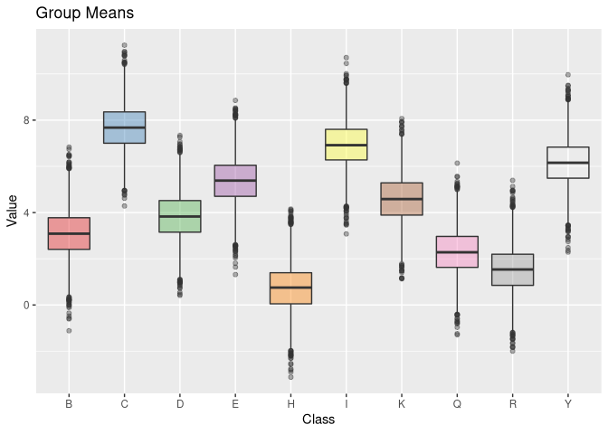

<!-- README.md is generated from README.Rmd. Please edit that file -->

# Ridge vs. Individual Linear Base-Learner

## Load compboost

``` r
devtools::load_all( "~/repos/compboost")
#> Loading compboost
```

## Simulate data

``` r
# Simulate Data:
nclasses = 10L
nsim = 50000L

classes = sample(x = LETTERS, size = nclasses)
gmean = sample(nclasses) * rnorm(1)

idx = sample(x = seq_len(nclasses), size = nsim, replace = TRUE)

x = classes[idx]
y = gmean[idx] + rnorm(nsim)

df_cat = data.frame(x = x, y = y)

library(ggplot2)
ggplot(data = df_cat, aes(x = x, y = y, fill = x)) +
  geom_boxplot(alpha = 0.4, show.legend = FALSE) +
  scale_fill_brewer(palette = "Set1") +
  xlab("Class") +
  ylab("Value") +
  ggtitle("Group Means")
#> Warning in RColorBrewer::brewer.pal(n, pal): n too large, allowed maximum for palette Set1 is 9
#> Returning the palette you asked for with that many colors
```

<!-- -->

## Set parameter for compboost

``` r
learning_rate = 0.05
iter_max      = 2000L
```

## Fit linear model for each category in feature (current state of the art)

``` r
cboost_lin = Compboost$new(data = df_cat, target = "y", loss = LossQuadratic$new())
cboost_lin$addBaselearner(feature = "x", id = "category", bl_factory = BaselearnerPolynomial, intercept = FALSE)
cboost_lin$train(iter_max, trace = as.integer(iter_max / 4))
#>    1/2000   risk = 3.2  
#>  500/2000   risk = 0.51  
#> 1000/2000   risk = 0.5  
#> 1500/2000   risk = 0.5  
#> 2000/2000   risk = 0.5  
#> 
#> 
#> Train 2000 iterations in 7 Seconds.
#> Final risk based on the train set: 0.5
```

## Fit ridge regression on categorical feature

``` r
response = ResponseRegr$new("mpg", as.matrix(df_cat$y))

cdata_source = CategoricalData$new(df_cat$x, "x")
bl = BaselearnerCategoricalRidge$new(cdata_source, list(df = 3))

factory_list = BlearnerFactoryList$new()
factory_list$registerFactory(bl)

loss_quadratic = LossQuadratic$new()
optimizer = OptimizerCoordinateDescent$new()

log_iterations = LoggerIteration$new(" iterations", TRUE, iter_max)
logger_list = LoggerList$new()
logger_list$registerLogger(log_iterations)

cboost_ridge = Compboost_internal$new(
  response      = response,
  learning_rate = learning_rate,
  stop_if_all_stopper_fulfilled = FALSE,
  factory_list = factory_list,
  loss         = loss_quadratic,
  logger_list  = logger_list,
  optimizer    = optimizer
)
cboost_ridge$train(trace = as.integer(iter_max / 4))
#>    1/2000   risk = 3  
#>  500/2000   risk = 0.5  
#> 1000/2000   risk = 0.5  
#> 1500/2000   risk = 0.5  
#> 2000/2000   risk = 0.5  
#> 
#> 
#> Train 2000 iterations in 5 Seconds.
#> Final risk based on the train set: 0.5
```

|                | Real.Means | Estimate.Ridge | Estimate.Linear |
| -------------- | ---------: | -------------: | --------------: |
| x\_D\_category |   \-8.1238 |       \-8.1197 |        \-8.1197 |
| x\_E\_category |   \-7.3114 |       \-7.3088 |        \-7.3087 |
| x\_I\_category |   \-6.4991 |       \-6.4779 |        \-6.4778 |
| x\_U\_category |   \-5.6867 |       \-5.6625 |        \-5.6624 |
| x\_P\_category |   \-4.8743 |       \-4.8767 |        \-4.8766 |
| x\_C\_category |   \-4.0619 |       \-4.0777 |        \-4.0777 |
| x\_Q\_category |   \-3.2495 |       \-3.2596 |        \-3.2596 |
| x\_Z\_category |   \-2.4371 |       \-2.4190 |        \-2.4190 |
| x\_L\_category |   \-1.6248 |       \-1.6180 |        \-1.6181 |
| x\_G\_category |   \-0.8124 |       \-0.8217 |        \-0.8218 |

## Microbenchmark

    #>    1/2000   risk = 0.53  
    #>  500/2000   risk = 0.51  
    #> 1000/2000   risk = 0.5  
    #> 1500/2000   risk = 0.5  
    #> 2000/2000   risk = 0.5  
    #> 
    #> 
    #> Train 2000 iterations in 13 Seconds.
    #> Final risk based on the train set: 0.5
    #> 
    #>    1/2000   risk = 0.53  
    #>  500/2000   risk = 0.5  
    #> 1000/2000   risk = 0.5  
    #> 1500/2000   risk = 0.5  
    #> 2000/2000   risk = 0.5  
    #> 
    #> 
    #> Train 2000 iterations in 4 Seconds.
    #> Final risk based on the train set: 0.5
    #> 
    #>    1/2000   risk = 0.53  
    #>  500/2000   risk = 0.51  
    #> 1000/2000   risk = 0.5  
    #> 1500/2000   risk = 0.5  
    #> 2000/2000   risk = 0.5  
    #> 
    #> 
    #> Train 2000 iterations in 12 Seconds.
    #> Final risk based on the train set: 0.5
    #> 
    #>    1/2000   risk = 0.53  
    #>  500/2000   risk = 0.5  
    #> 1000/2000   risk = 0.5  
    #> 1500/2000   risk = 0.5  
    #> 2000/2000   risk = 0.5  
    #> 
    #> 
    #> Train 2000 iterations in 4 Seconds.
    #> Final risk based on the train set: 0.5
    #> 
    #>    1/2000   risk = 0.53  
    #>  500/2000   risk = 0.5  
    #> 1000/2000   risk = 0.5  
    #> 1500/2000   risk = 0.5  
    #> 2000/2000   risk = 0.5  
    #> 
    #> 
    #> Train 2000 iterations in 4 Seconds.
    #> Final risk based on the train set: 0.5
    #> 
    #>    1/2000   risk = 0.53  
    #>  500/2000   risk = 0.51  
    #> 1000/2000   risk = 0.5  
    #> 1500/2000   risk = 0.5  
    #> 2000/2000   risk = 0.5  
    #> 
    #> 
    #> Train 2000 iterations in 13 Seconds.
    #> Final risk based on the train set: 0.5
    #> 
    #>    1/2000   risk = 0.53  
    #>  500/2000   risk = 0.51  
    #> 1000/2000   risk = 0.5  
    #> 1500/2000   risk = 0.5  
    #> 2000/2000   risk = 0.5  
    #> 
    #> 
    #> Train 2000 iterations in 13 Seconds.
    #> Final risk based on the train set: 0.5
    #> 
    #>    1/2000   risk = 0.53  
    #>  500/2000   risk = 0.5  
    #> 1000/2000   risk = 0.5  
    #> 1500/2000   risk = 0.5  
    #> 2000/2000   risk = 0.5  
    #> 
    #> 
    #> Train 2000 iterations in 4 Seconds.
    #> Final risk based on the train set: 0.5
    #> 
    #>    1/2000   risk = 0.53  
    #>  500/2000   risk = 0.5  
    #> 1000/2000   risk = 0.5  
    #> 1500/2000   risk = 0.5  
    #> 2000/2000   risk = 0.5  
    #> 
    #> 
    #> Train 2000 iterations in 5 Seconds.
    #> Final risk based on the train set: 0.5
    #> 
    #>    1/2000   risk = 0.53  
    #>  500/2000   risk = 0.51  
    #> 1000/2000   risk = 0.5  
    #> 1500/2000   risk = 0.5  
    #> 2000/2000   risk = 0.5  
    #> 
    #> 
    #> Train 2000 iterations in 13 Seconds.
    #> Final risk based on the train set: 0.5
    #> 
    #>    1/2000   risk = 0.53  
    #>  500/2000   risk = 0.5  
    #> 1000/2000   risk = 0.5  
    #> 1500/2000   risk = 0.5  
    #> 2000/2000   risk = 0.5  
    #> 
    #> 
    #> Train 2000 iterations in 5 Seconds.
    #> Final risk based on the train set: 0.5
    #> 
    #>    1/2000   risk = 0.53  
    #>  500/2000   risk = 0.51  
    #> 1000/2000   risk = 0.5  
    #> 1500/2000   risk = 0.5  
    #> 2000/2000   risk = 0.5  
    #> 
    #> 
    #> Train 2000 iterations in 14 Seconds.
    #> Final risk based on the train set: 0.5
    #> 
    #>    1/2000   risk = 0.53  
    #>  500/2000   risk = 0.51  
    #> 1000/2000   risk = 0.5  
    #> 1500/2000   risk = 0.5  
    #> 2000/2000   risk = 0.5  
    #> 
    #> 
    #> Train 2000 iterations in 11 Seconds.
    #> Final risk based on the train set: 0.5
    #> 
    #>    1/2000   risk = 0.53  
    #>  500/2000   risk = 0.51  
    #> 1000/2000   risk = 0.5  
    #> 1500/2000   risk = 0.5  
    #> 2000/2000   risk = 0.5  
    #> 
    #> 
    #> Train 2000 iterations in 11 Seconds.
    #> Final risk based on the train set: 0.5
    #> 
    #>    1/2000   risk = 0.53  
    #>  500/2000   risk = 0.5  
    #> 1000/2000   risk = 0.5  
    #> 1500/2000   risk = 0.5  
    #> 2000/2000   risk = 0.5  
    #> 
    #> 
    #> Train 2000 iterations in 4 Seconds.
    #> Final risk based on the train set: 0.5
    #> 
    #>    1/2000   risk = 0.53  
    #>  500/2000   risk = 0.5  
    #> 1000/2000   risk = 0.5  
    #> 1500/2000   risk = 0.5  
    #> 2000/2000   risk = 0.5  
    #> 
    #> 
    #> Train 2000 iterations in 4 Seconds.
    #> Final risk based on the train set: 0.5
    #> 
    #>    1/2000   risk = 0.53  
    #>  500/2000   risk = 0.51  
    #> 1000/2000   risk = 0.5  
    #> 1500/2000   risk = 0.5  
    #> 2000/2000   risk = 0.5  
    #> 
    #> 
    #> Train 2000 iterations in 12 Seconds.
    #> Final risk based on the train set: 0.5
    #> 
    #>    1/2000   risk = 0.53  
    #>  500/2000   risk = 0.51  
    #> 1000/2000   risk = 0.5  
    #> 1500/2000   risk = 0.5  
    #> 2000/2000   risk = 0.5  
    #> 
    #> 
    #> Train 2000 iterations in 12 Seconds.
    #> Final risk based on the train set: 0.5
    #> 
    #>    1/2000   risk = 0.53  
    #>  500/2000   risk = 0.5  
    #> 1000/2000   risk = 0.5  
    #> 1500/2000   risk = 0.5  
    #> 2000/2000   risk = 0.5  
    #> 
    #> 
    #> Train 2000 iterations in 5 Seconds.
    #> Final risk based on the train set: 0.5
    #> 
    #>    1/2000   risk = 0.53  
    #>  500/2000   risk = 0.51  
    #> 1000/2000   risk = 0.5  
    #> 1500/2000   risk = 0.5  
    #> 2000/2000   risk = 0.5  
    #> 
    #> 
    #> Train 2000 iterations in 12 Seconds.
    #> Final risk based on the train set: 0.5
    #> 
    #>    1/2000   risk = 0.53  
    #>  500/2000   risk = 0.51  
    #> 1000/2000   risk = 0.5  
    #> 1500/2000   risk = 0.5  
    #> 2000/2000   risk = 0.5  
    #> 
    #> 
    #> Train 2000 iterations in 12 Seconds.
    #> Final risk based on the train set: 0.5
    #> 
    #>    1/2000   risk = 0.53  
    #>  500/2000   risk = 0.5  
    #> 1000/2000   risk = 0.5  
    #> 1500/2000   risk = 0.5  
    #> 2000/2000   risk = 0.5  
    #> 
    #> 
    #> Train 2000 iterations in 4 Seconds.
    #> Final risk based on the train set: 0.5
    #> 
    #>    1/2000   risk = 0.53  
    #>  500/2000   risk = 0.5  
    #> 1000/2000   risk = 0.5  
    #> 1500/2000   risk = 0.5  
    #> 2000/2000   risk = 0.5  
    #> 
    #> 
    #> Train 2000 iterations in 5 Seconds.
    #> Final risk based on the train set: 0.5
    #> 
    #>    1/2000   risk = 0.53  
    #>  500/2000   risk = 0.5  
    #> 1000/2000   risk = 0.5  
    #> 1500/2000   risk = 0.5  
    #> 2000/2000   risk = 0.5  
    #> 
    #> 
    #> Train 2000 iterations in 5 Seconds.
    #> Final risk based on the train set: 0.5
    #> 
    #>    1/2000   risk = 0.53  
    #>  500/2000   risk = 0.51  
    #> 1000/2000   risk = 0.5  
    #> 1500/2000   risk = 0.5  
    #> 2000/2000   risk = 0.5  
    #> 
    #> 
    #> Train 2000 iterations in 16 Seconds.
    #> Final risk based on the train set: 0.5
    #> 
    #>    1/2000   risk = 0.53  
    #>  500/2000   risk = 0.5  
    #> 1000/2000   risk = 0.5  
    #> 1500/2000   risk = 0.5  
    #> 2000/2000   risk = 0.5  
    #> 
    #> 
    #> Train 2000 iterations in 6 Seconds.
    #> Final risk based on the train set: 0.5
    #> 
    #>    1/2000   risk = 0.53  
    #>  500/2000   risk = 0.5  
    #> 1000/2000   risk = 0.5  
    #> 1500/2000   risk = 0.5  
    #> 2000/2000   risk = 0.5  
    #> 
    #> 
    #> Train 2000 iterations in 4 Seconds.
    #> Final risk based on the train set: 0.5
    #> 
    #>    1/2000   risk = 0.53  
    #>  500/2000   risk = 0.5  
    #> 1000/2000   risk = 0.5  
    #> 1500/2000   risk = 0.5  
    #> 2000/2000   risk = 0.5  
    #> 
    #> 
    #> Train 2000 iterations in 4 Seconds.
    #> Final risk based on the train set: 0.5
    #> 
    #>    1/2000   risk = 0.53  
    #>  500/2000   risk = 0.51  
    #> 1000/2000   risk = 0.5  
    #> 1500/2000   risk = 0.5  
    #> 2000/2000   risk = 0.5  
    #> 
    #> 
    #> Train 2000 iterations in 12 Seconds.
    #> Final risk based on the train set: 0.5
    #> 
    #>    1/2000   risk = 0.53  
    #>  500/2000   risk = 0.5  
    #> 1000/2000   risk = 0.5  
    #> 1500/2000   risk = 0.5  
    #> 2000/2000   risk = 0.5  
    #> 
    #> 
    #> Train 2000 iterations in 4 Seconds.
    #> Final risk based on the train set: 0.5
    #> 
    #>    1/2000   risk = 0.53  
    #>  500/2000   risk = 0.51  
    #> 1000/2000   risk = 0.5  
    #> 1500/2000   risk = 0.5  
    #> 2000/2000   risk = 0.5  
    #> 
    #> 
    #> Train 2000 iterations in 12 Seconds.
    #> Final risk based on the train set: 0.5
    #> 
    #>    1/2000   risk = 0.53  
    #>  500/2000   risk = 0.5  
    #> 1000/2000   risk = 0.5  
    #> 1500/2000   risk = 0.5  
    #> 2000/2000   risk = 0.5  
    #> 
    #> 
    #> Train 2000 iterations in 5 Seconds.
    #> Final risk based on the train set: 0.5
    #> 
    #>    1/2000   risk = 0.53  
    #>  500/2000   risk = 0.51  
    #> 1000/2000   risk = 0.5  
    #> 1500/2000   risk = 0.5  
    #> 2000/2000   risk = 0.5  
    #> 
    #> 
    #> Train 2000 iterations in 13 Seconds.
    #> Final risk based on the train set: 0.5
    #> 
    #>    1/2000   risk = 0.53  
    #>  500/2000   risk = 0.51  
    #> 1000/2000   risk = 0.5  
    #> 1500/2000   risk = 0.5  
    #> 2000/2000   risk = 0.5  
    #> 
    #> 
    #> Train 2000 iterations in 14 Seconds.
    #> Final risk based on the train set: 0.5
    #> 
    #>    1/2000   risk = 0.53  
    #>  500/2000   risk = 0.5  
    #> 1000/2000   risk = 0.5  
    #> 1500/2000   risk = 0.5  
    #> 2000/2000   risk = 0.5  
    #> 
    #> 
    #> Train 2000 iterations in 4 Seconds.
    #> Final risk based on the train set: 0.5
    #> 
    #>    1/2000   risk = 0.53  
    #>  500/2000   risk = 0.5  
    #> 1000/2000   risk = 0.5  
    #> 1500/2000   risk = 0.5  
    #> 2000/2000   risk = 0.5  
    #> 
    #> 
    #> Train 2000 iterations in 4 Seconds.
    #> Final risk based on the train set: 0.5
    #> 
    #>    1/2000   risk = 0.53  
    #>  500/2000   risk = 0.51  
    #> 1000/2000   risk = 0.5  
    #> 1500/2000   risk = 0.5  
    #> 2000/2000   risk = 0.5  
    #> 
    #> 
    #> Train 2000 iterations in 12 Seconds.
    #> Final risk based on the train set: 0.5
    #> 
    #>    1/2000   risk = 0.53  
    #>  500/2000   risk = 0.5  
    #> 1000/2000   risk = 0.5  
    #> 1500/2000   risk = 0.5  
    #> 2000/2000   risk = 0.5  
    #> 
    #> 
    #> Train 2000 iterations in 5 Seconds.
    #> Final risk based on the train set: 0.5
    #> 
    #>    1/2000   risk = 0.53  
    #>  500/2000   risk = 0.51  
    #> 1000/2000   risk = 0.5  
    #> 1500/2000   risk = 0.5  
    #> 2000/2000   risk = 0.5  
    #> 
    #> 
    #> Train 2000 iterations in 17 Seconds.
    #> Final risk based on the train set: 0.5
    #> 
    #>    1/2000   risk = 0.53  
    #>  500/2000   risk = 0.51  
    #> 1000/2000   risk = 0.5  
    #> 1500/2000   risk = 0.5  
    #> 2000/2000   risk = 0.5  
    #> 
    #> 
    #> Train 2000 iterations in 13 Seconds.
    #> Final risk based on the train set: 0.5
    #> Unit: seconds
    #>    expr    min     lq  mean median     uq    max neval
    #>  linear 11.428 12.496 13.43 13.224 13.717 17.793    20
    #>   ridge  4.451  4.584  4.91  4.766  5.157  6.052    20
